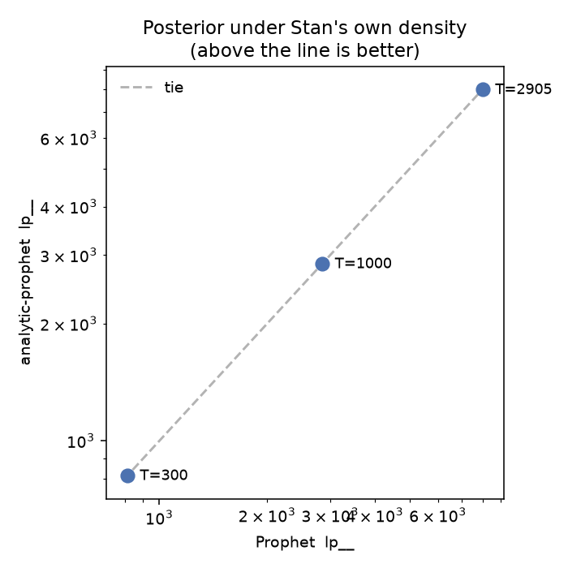
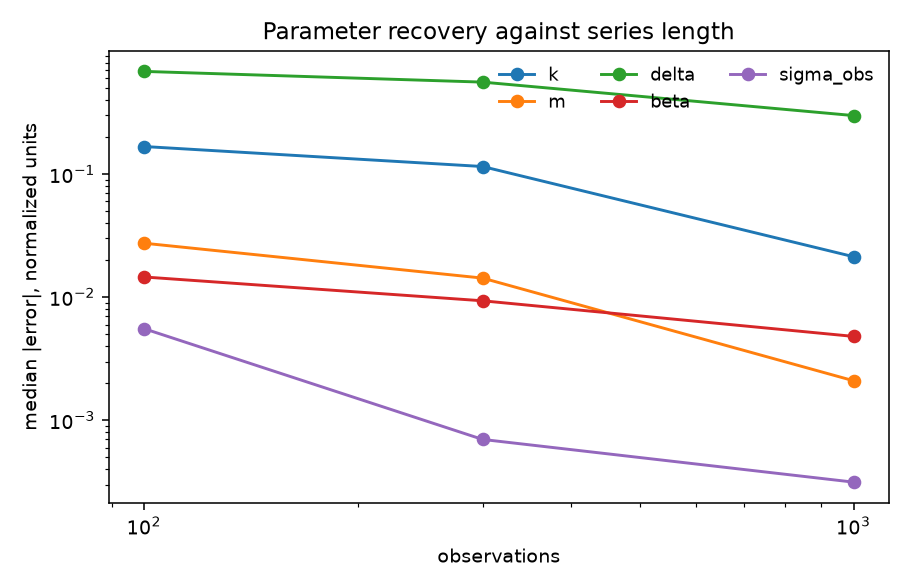
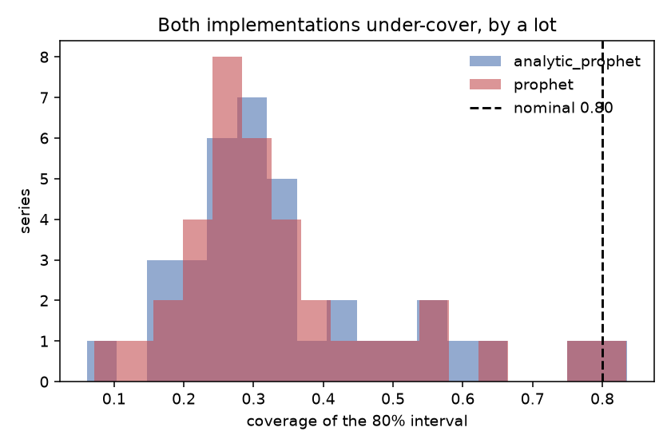
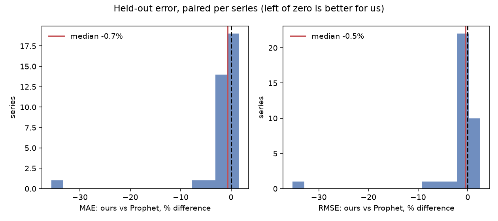
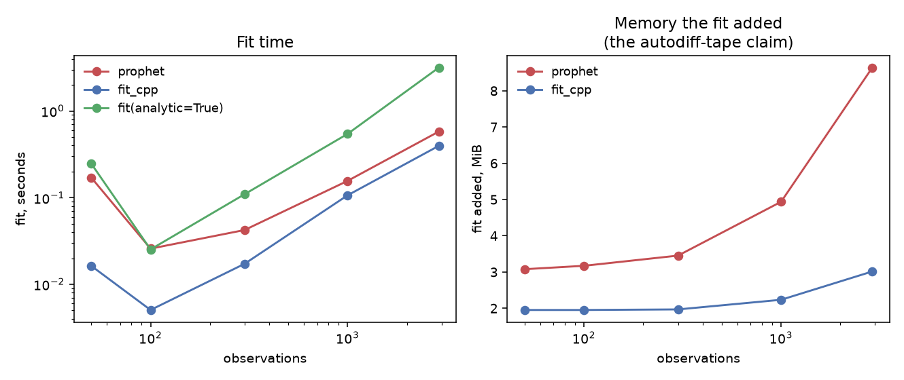

# Evaluation report

Generated by `python evaluation/report.py` from the committed results in `results/`. It refits nothing — regenerating it on another machine reproduces this file exactly, and two reports diff to show what moved.

## Tier 0 — are the two fitting the same model?

**Gate: PASSED**. Everything below it is about the difference between two optimizers, and means nothing if they are optimizing different specifications.

| T | design matrix | prior scales | changepoints | Prophet `lp__` | ours | difference |
|---|---|---|---|---|---|---|
| 300 | 7.3e-12 | 0e+00 | 0e+00 | 813.3508 | **815.3373** | +1.9864 |
| 1000 | 7.3e-12 | 0e+00 | 0e+00 | 2852.7676 | **2855.5280** | +2.7604 |
| 2905 | 7.3e-12 | 0e+00 | 0e+00 | 8004.7980 | **8005.1588** | +0.3608 |

The design-matrix figure is the Fourier basis evaluated in a different order — arithmetic, not model.

## Tier 1 — who recovers the true parameters?

Series generated from the model, so there is a true parameter vector to be right about. On real data there is not, and agreement between two fits is all anyone can measure.

| distance | ours wins |
|---|---|
| raw `‖θ̂ − θ*‖` | 7 / 18 |
| **identified** `½dᵀH(θ*)d` | **14 / 18** |

Median paired difference -0.265 nats, Wilcoxon p = 0.0034.

The two disagree, and that is the finding. Raw distance is a coin flip because it is dominated by the directions the data does not identify — `k` against `delta`, where being far away costs nothing and means nothing.

> The identified error is in **nats** and the curvature grows with the sample, so it compares implementations on one series and does not pool across lengths. Hence the pairing.

Active changepoints: truth 6–11, ours 0–9, Prophet 2–20. Neither is calibrated — see #88.

## Tier 2 — does the better MAP point forecast better?

The question the README explicitly refuses to answer. Rolling-origin evaluation on cutoffs from `prophet.diagnostics.generate_cutoffs`, scored by `prophet.diagnostics.performance_metrics` — both sides get the same splits and the same scorer.

| metric | median difference | wins | p |
|---|---|---|---|
| mae | -1.9142 | 26/36 | 0.0063 |
| rmse | -2.9667 | 25/36 | 0.0183 |
| mape | -0.0007 | 26/36 | 0.0013 |
| smape | -0.0004 | 24/36 | 0.0139 |
| coverage | +0.0003 | 16/36 | 0.7976 |
| interval_width | -2.7108 | 30/36 | 0.0000 |
| active_changepoints | -5.0000 | 36/36 | 0.0000 |

Negative means we are lower, which is better for every row but coverage. **The better MAP point does forecast better** on this corpus, with narrower intervals at indistinguishable coverage.

### The finding that is not about us

**Both implementations badly under-cover.** Mean coverage of the nominal 80% interval is **0.353** for ours and **0.342** for Prophet's — the intervals contain about a third of the points they claim four fifths of. That is the model on long horizons and volatile series, shared by both, and it is larger than anything separating them.

## Tier 3 — what it costs

| T | Prophet | `fit_cpp` | `fit(analytic=True)` |
|---|---|---|---|
| 50 | 0.171 s | **0.016 s** | 0.247 s |
| 100 | 0.026 s | **0.005 s** | 0.025 s |
| 300 | 0.042 s | **0.017 s** | 0.110 s |
| 1000 | 0.156 s | **0.107 s** | 0.545 s |
| 2905 | 0.580 s | **0.397 s** | 3.176 s |

Peak resident memory, **split into what the import cost and what the fit did**. The README's claim is about the fit — autodiff retains a tape and a closed-form gradient does not — so a baseline taken before the import measures something else.

| T | Prophet fit | ours fit | Prophet import | ours import |
|---|---|---|---|---|
| 50 | 3.1 MiB | **2.0 MiB** | **38.2 MiB** | 57.8 MiB |
| 100 | 3.2 MiB | **2.0 MiB** | **38.2 MiB** | 58.0 MiB |
| 300 | 3.5 MiB | **2.0 MiB** | **38.2 MiB** | 57.8 MiB |
| 1000 | 4.9 MiB | **2.2 MiB** | **38.1 MiB** | 57.7 MiB |
| 2905 | 8.6 MiB | **3.0 MiB** | **38.3 MiB** | 57.8 MiB |

We win the fit and lose the import — the latter almost entirely scipy, which Prophet does not pull. A library that is expensive to merely import is still expensive to deploy.

### The one thing we are slower at

`predict` at T=2905 takes **0.557 s** against Prophet's 0.223 s. Profiled, 85% of it is a Python loop over the uncertainty draws — see #87.

### Scaling

| implementation | d log wall / d log T |
|---|---|
| prophet | 0.46 |
| fit_cpp | 0.94 |
| fit(analytic=True) | 0.84 |

Read these with the figure rather than on their own. Every implementation is *slower* at T=50 than at T=100, which is not noise and not subprocess overhead: below 100 observations Prophet's rule selects **Newton** (#25), and both sides follow it. Newton pays `2n` gradient evaluations an iteration for its Hessian. The exponents are fitted through that kink, so they understate the asymptotic slope — Prophet's 0.46 in particular is mostly the kink plus a fixed subprocess spawn, not a claim that its fit is sub-linear.

---

## How this was measured

- seed `20260925`, commit `79303bdb5a41`
- python 3.14.7 on macOS-26.5.2-arm64-arm-64bit-Mach-O
- cmdstanpy 1.3.0, numpy 2.5.3, pandas 3.0.5, prophet 1.4.0, scipy 1.18.1

Each tier writes `results/<tier>.csv` sorted, so rerunning an unchanged tier produces an unchanged file and a rerun is a reviewable diff rather than a number to be trusted.
